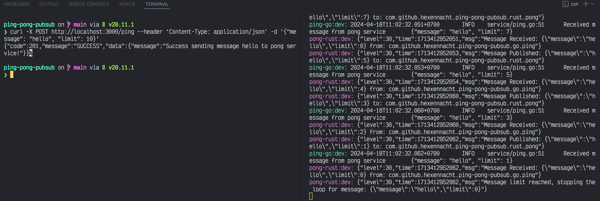

# PING PONG PUBSUB

This repository contains a simple implementation of a ping-pong messaging system using the publish-subscribe pattern using go, rust and redis.



## Installation

To use the ping-pong pubsub system in your project, follow these steps:

1. Clone the repository:

    ```bash
    git clone https://github.com/your-username/ping-pong-pubsub.git
    ```

2. Install the required dependencies:

    ```bash
    npm install
    ```

## Usage

To use the ping-pong pubsub, follow these steps:

1. Install redis using docker

2. Run dev command

    ```shel
    npm run dev
    ```

## Contributing

Contributions are welcome! If you find any issues or have suggestions for improvements, please open an issue or submit a pull request.

## License

This project is licensed under the MIT License. See the [LICENSE](LICENSE) file for more information.